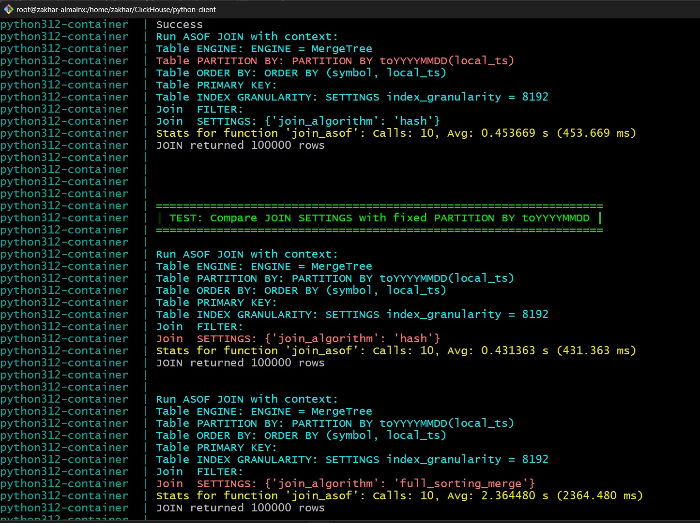

# Оптимизация запросов ASOF JOIN в ClickHouse

## Описание задачи

Задача описана [здесь](https://github.com/orientcap/clickhouse-asof-join). Я не уточнял детали реального использования ASOF JOIN в повседневной работе. Вместо этого поэкспериментировал с разными бизнес-кейсами на свое усмотрение.

## Структура репозитория

В папке ``clickhouse-md-svr`` находится только файл ``compose.yml`` для запуска ClickHouse через ``docker compose``

В папке ``python-client`` размещен python-код для запуска тестов. Предполагается запуск из контейнера, поэтому здесь находится второй файл ``compose.yml`` 

## Запуск теста

Запускаем на хосте с Linux с установленным ``docker compose``. Я использовал ``Alma 10``, но должно работать на относительно свежих версиях других дистрибутивов.

Аппаратная конфигурация у меня была следующая:
- виртуальная машина Hyper-V
- 2 Гб RAM
- 8 ядер CPU
- 20 Гб на SSD-разделе.

Сначала необходимо перейти в папку ``clickhouse-md-svr`` и запустить ClickHouse server:

```
docker compose up -d
```

Он скачает самый последний образ ClickHouse, создаст внутреннюю сеть, настроит имя сервера, порт, базу, пользователя.

Далее переходим в папку ``python-client``. Можно запустить непосредственно на хосте, имея установленный Python 3 (запускал на 3.12) с библиотекой ``clickhouse-connect``. Но тогда придется пробрасывать host name и сеть из контейнера ClickHouse server

Проще запустить в докере в интерактивном режиме:

```
docker compose up
```

Будет сделано следующее:

1. Скачается образ ``Python 3.12``
2. Установится библиотека ``clickhouse-connect``
3. Запустится тестирующий скрипт. Он использует сеть, базу и пользователя, созданные при старте контейнера с ClickHouse.
4. При желании можно настроить объем генерируемых данных в файле ``config.py``. Я не стал делать YAML из-за нехватки времени. По умолчанию ``NUM_QUOTES = 10_000_000``, ``NUM_TRADES = 100_000``.
   Флаг ``REGENERATE_DATASET`` должен быть равен ``True`` для первоначального создания датасета. В дальнейшем тест сценарии могут ставить его в ``False``, если у конкретного теста нет задачи пересоздать схему с другими настройками таблиц. Сейчас каждый тест сам решает, надо ли пересоздавать таблицы.
5. Скрипт создает таблицы, заполняет их псевдо-реальными данными, пытаясь подобрать сделки в соответствии с квотами и распределяя их рандомно по временному диапазону, по биржам и тикерам. Разброс цен я попытался сделать реалистичным.
6. Дополнительно создается Materialized View с результатми ASOF JOIN для сравнения с прямым исполнением ASOF JOIN.
8. После создания датасета скрипт ждет, когда физическая структура файлов базы закончит перестройку с учетом партиционирования.
9. Далее запускается бенчмарки, и в ходе запуска печатается статистика по временам запуска и детали конкретных кейсов. Общее время запуска на дефолтном датасете - примерно 25-30 минут. С каждой настройкой запуск ``ASOF JOIN`` повторяется по умолчанию 10 раз и усредняется. Количество запусков настраивается параметром декоратора ``n_calls``. Результат работы теста выглядит примерно как на скрине ниже:



Замечание. В папке sql лежат исходные DDL-скрипты из задачи, но я их не использую в коде, а использую свои, которые прописаны в строках в Python-коде. Идея была сделать шаблоны с параметрами для настроек, но не хватает сейчас времени. Сам скрипт печатает детальную, красиво отформатированную статистику.

## Анализ результатов

В процессе тестирования в первую очередь выяснилось, что на предложенном размере датасета (1М квот и 10k сделок) плохо видны оптимизации - все работает быстро. Это связано с тем, что все данные помещаются в память с большим запасом, нет чтения с диска. Возможно, даже помещаются в кэш.

При увеличении числа квот и сделок в 10 раз стали отличия для разных оптимизаций стали более заметными. Придется немного больше подождать, пока тест отработает - 10-15 минут.

### Измерения и выводы

Это многофакторная задача с большим числом параметров и зависимыми друг от друга условиями. К тому же она сильно зависит от реального распределения данных и сценариев использования. Поэтому я не могу охватить все направления, а также на реальных датасетах результаты могут отличаться.

1. Сначала про вставку данных. Попробовал вставку батчами разного размера. Остановился на размере 100k. 1-10k кратно медленнее, что ожидаемо для колоночной СУБД с переупаковской столбцов при вставке. Больше 100k уже эффекта нет, а для реальной жизни такие размеры увеличивают риск потери данных при падении приложения. Но я не знаю вашу специфику вставки. Возможно, у вас не так много источников данных, поэтому такие батчи накапливать нецелесообразно и лучше скидывать в базу почаще, не смотря на то, что это менее эффективно.
2. Остановился на датасете с 10М квот и 100к трейдов - там уже есть хоть какая-то возможность эффективного партиционирования и объем данных на диске > 1 Гб.
3. Далее пишем сам ASOF JOIN, добавил несколько полей в сравнении с оригинальной задачей, чтобы проверить корректность данных:

```sql     
SELECT 
   t.symbol,
   t.side as trade_side,
   t.qty as trade_qty,
   t.local_ts as trade_local_ts,
   q.local_ts as quote_local_ts,
   t.price as trade_price,
   q.bid_price as bid_price,
   q.ask_price as ask_price,
   -- Additional fields to check dataset correctness
   t.price - q.bid_price as spread_to_bid,
   q.ask_price - t.price as spread_to_ask,
   dateDiff('microsecond', q.local_ts, t.local_ts) AS quote_to_request_latency_us
FROM md_trades AS t
ASOF LEFT JOIN md_quotes AS q
   ON t.symbol = q.symbol 
   AND t.local_ts >= q.local_ts -- trade comes after quote received
```

4. Сначала сравнил работу разных алгоритмов ``ASOF JOIN``. Проверил ``hash, parallel_hash, full_sorting_merge, default, auto``. Сначала делал полный ``ASOF JOIN`` без фильтрации по значениям. Реальное отличие увидел только между ``full_sorting_merge`` и ``hash``. Дефолтный и автоматический, скорее всего, используют ``hash``, так как результаты у них совпали. ``parallel_hash`` тоже не опередил ``hash``. Как потом оказалось, он не поддерживает ASOF JOIN, и ClickHouse  просто игнорирует эту настройку. Для полного JOIN обеих таблиц без фильтрации ``full_sorting_merge`` оказался почти на порядок медленее. Однако, в дальнейших тестах удалось найти случаи, где он быстрее простого ``hash``. Но на этом этапе ускорения не получилось.
5. Далее взял алгоритм ``hash`` и сравнил разные варианты `PARTITION BY` без фильрации по `WHERE/PREWHERE`. Итог ожидаемый - партиционирование добавиило немного накладных расходов на итерацию по отдельным партициям, поэтому, если нет фильтрации, то с ним запросы чуть медленее - вышло замедление процентов 10 для партиции по неделям и 15% для партиции по дням.
7. Что более интересно - добавление ``WHERE/PREWHERE`` ничего не поменяло - партиционирование все так же добавляет накладные расходы на чтение и с ним JOIN медленее. Мой вывод такой: партиционирование (даже по той колонке, по которй делается JOIN) не помогает ускорить запрос, потому что ClickHouse все равно сканирует индексы в каждой партиции, не полагаясь на имена папок на диске. Поэтому сканирование множества папок дольше, чем одной. Тем более, что у нас построен индекс по колонке local_ts, и поиск диапазона по индексу очень быстрый. Однако, без партиционирования будет проблема при удалении диапазонов по датам и при интенсивной вставке данных, поэтому от него не отказываемся и смотрим на другие возмжности оптимизации.
8. Обратил внимание, что партиционироание происходит не мгновенно даже при первичном наполнении таблицы. Сначала для каждой партиции создается несколько папок, а потом в фоне идет merge. Примерно 10 минут требуется для полного слияния. Я в тестах не ждал это время. И именно поэтому я не переделывал партиции у готового датасета, а пересоздавал каждый раз заново - если перестраивать готовый, то тоже надо ждать, причем не очень определенное время. Есть специальная команда ``OPTIMIZE TABLE md_trades FINAL``но после ее выполнения все равно остается часть чанков. 
9. Изучил работу WHERE/PREWHERE. Ожидал, что PREWHERE должен быть всегда быстрее, так как данные фильтруются до JOIN. Однако, во-первых, ``PREWHERE`` умеет фиьтровать только по левой таблице для LEFT ASOF JOIN, и если указать фильтр по правой - он просто игнорируется. А, во вторых, я не увидел даже отличий при реальной фильтрации по WHERE vs PREWHERE, даже если фильтруем не по колонке сортировки. Могу объяснить это тем, что в колночной базе для фильра считывается всего одна колонка, и это быстро в любом случае. Но необходимо поизучать планы выполнения, чтобы это подтвердить, а времени пока не хватило.
10. Далее потестировал разную гранулярность индексов - от 1 до 8192. При гранулярности до 1024 запросы замедляются - накладные расходы идут на чтение большого индекса. Далее 1024-4096 скорость запроса примерно одинакова. Для 8192 чуть медленее - процентов на 5. Возможно, статистическая погрешность, но видел это отличие несколко раз. Очень большой размер гранулы должен замедлять поиск по индексу, так как внутри гранулы просматривать дольше, чем отсекать гранулы. Нужно искать баланс на реальных данных.
11. Для сравнения создал ``MATERIALIZED VIEW`` с результатами ASOF JOIN. Запросы к нему работают примерно в 10 раз быстрее, потому что JOIN уже не происходит. Если в реальной жизни запросы идут внутри одной недели, то можно создавать такое VIEW по каждой неделеи и работать с ними. Также прочитал, что есть MV с автоматическим обновлением по расписанию, но не проверял их работу.
12. На изучение проекций не хватило времени, но из того, что прочитал про них - они созданы для работы с одной таблицей, а не с результатом JOIN. И, хотя они могу помочь с дополнительными вариантами сортировки - надо очень тщательно тестировать, потому что ASOF JOIN тоже вероятно строит похожие проекции в процессе работы.
13. Не стал экспериментировать с типами данных и компрессией для колонок. Полагаю, что большого выигрыша здесь не получим, но нужны объемные тесты.
14. По окончании тестов неожиданно нашел *хороший вариант оптимизации*. Если мы применяем фильтр, котоый отсекает большую часть данных, то оставшиеся 1-5 тыс строк, особенно отсортированных по ключу, отлично работают с full_sorting_merge алгоритмом в стравнении с hash. Прирост скорости около 40%. Однако, если JOIN идет по очень большому числу строк, то этот вид алгоритма не помогает и даже ухудшает производительность. Вот [здесь описан этот вопрос подробнее](https://github.com/clickhouse/clickhouse/issues/86901). Стал искать детали и нашел вот такую версию: при большом числе строк, дуже отсортированных, full_sorting_merge использует для слияния структуру "очередь с приоритетом", которая может давать существенные накладные расходы при росте числа строк. Но проверить это не успеваю. 

## Итоги оптимизации

Все оптимизации зависят от реальных данных, причем изменения могут быть [в обе стороны](https://clickhouse.com/docs/guides/joining-tables).

На данный момент я смог найти два варианта ускорить запрос.

1. Выбор алгоритма ``full_sorting_merge``, но при условии, что фильтр отсекает большую часть данных:

```sql
SELECT 
   t.symbol,
   t.side as trade_side,
   t.qty as trade_qty,
   t.local_ts as trade_local_ts,
   q.local_ts as quote_local_ts,
   t.price as trade_price,
   q.bid_price as bid_price,
   q.ask_price as ask_price
FROM md_trades AS t
ASOF LEFT JOIN md_quotes AS q
   ON t.symbol = q.symbol 
   AND t.local_ts >= q.local_ts
PREWHERE
   -- Filter 1 day
   t.local_ts between '2026-04-27 00:00:00' AND '2026-04-27 23:59:59.999'
SETTINGS join_algorithm = 'full_sorting_merge';
```
2. Создать нужные нам MATERIALIZED VIEW. Возможно, с пересчетом по расписанию раз в N минут/часов/дней, зависит от задачи.

```sql
CREATE MATERIALIZED VIEW IF NOT EXISTS mv_trade_quote_asof_join
ENGINE = MergeTree
ORDER BY (symbol, trade_local_ts)
SETTINGS index_granularity = 8192
POPULATE  -- Fill on creation
AS
SELECT 
      t.symbol,
      t.side as trade_side,
      t.qty as trade_qty,
      t.local_ts as trade_local_ts,
      q.local_ts as quote_local_ts,
      t.price as trade_price,
      q.bid_price as bid_price,
      q.ask_price as ask_price
FROM md_trades AS t
ASOF LEFT JOIN md_quotes AS q
    ON t.symbol = q.symbol 
    AND t.local_ts >= q.local_ts
```

Остальные параметры практически не улучшают скорость. Таблицы изначально правльно организованы для ``ASOF JOIN``.